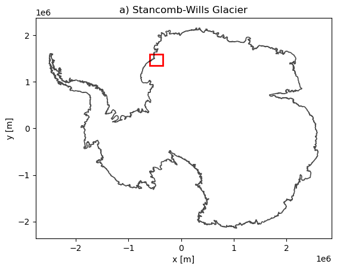
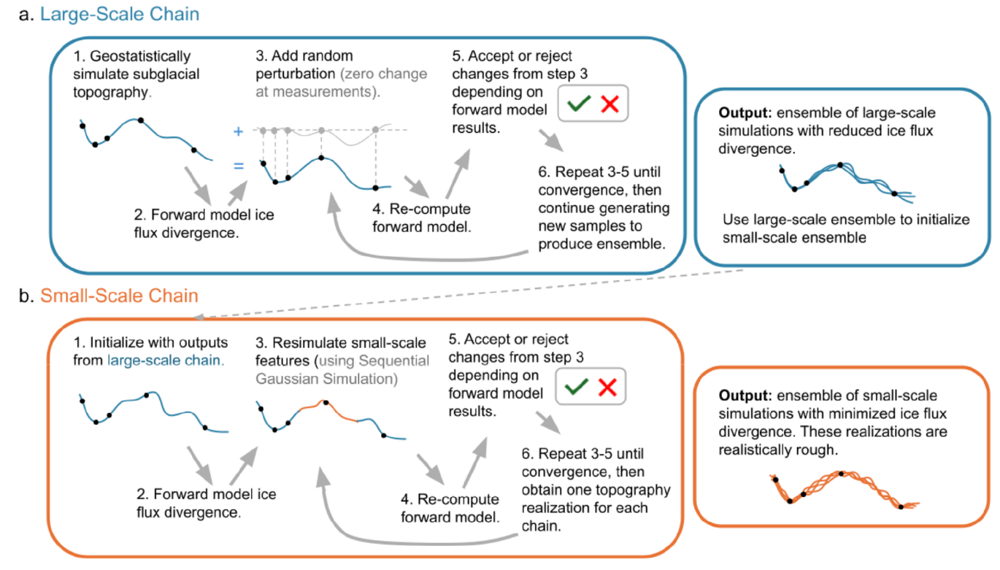

# TopographyMCMC
Repository containing code for subglacial bed interpolation of the Stancomb-Wills Glacier in Eastern Anartica, utilizing Sequential Gaussian Simulation in combination with Markov-Chain Monte Carlo to produce physically constrained topographies with realistic roughness.
## Table of Contents
1. [Overview](#overview)
2. [Glacier Background](#glacier-background)
3. [Methodology](#methodology)
4. [Usage Guide](#usage-guide)
5. [Data](#data)
6. [Contributors](#contributors)

---
## Overview
Subglacial topography, or the elevation of the bed underneath glaciers, is one of the greatest sources of uncertainty in climate change modeling. However, traditional bed interpolation methods such as kriging and sequential gaussian simulation fail to account for mass conservation, producing ice thicknesses that are incompatible with ice velocity measurements. Additionally, traditional inverse methods based on the mass conservation law produce overly smooth, unrealistic topographies. As a result, we introduce a Markov-chain Monte Carlo that preserves both realistic topographical roughness and mass conservation.
## Glacier Background

  

Our study area is the Stancomb-Wills Glacier, which is located on the Caird Coast on the western shore of the Weddell Sea. The glacier’s surface area is around 124,000 kilometers The ice stream feeds into the glacier's ice tongue at a rate of around 750 meters per year.

  

## Methodology
- Our Markov chain Monte Carlo approach first involves computing a variogram to use sequential gaussian simulation to produce an initial topography. We then compute the ice flux divergence of this simulation. We then run a large-scale chain followed by a small-scale chain.
- **Large-Scale Chain**: For each iteration, we randomly perturb parts of the topography then recompute the ice flux divergence. If the divergence is less than that of the previous iteration, we keep this new topography.
- **Small-Scale Chain**: For each iteration, we use to sequential gaussian simulation to re-simulate parts of the topography then recompute the ice flux divergence. If the divergence is less than that of the previous iteration, we keep this new topography.

  

## Usage Guide
## Data

- the MEaSUREs InSAR-Based Antarctica Ice Velocity Map (Ver 2), https://nsidc.org/data/nsidc-0484/versions/2
- Surface Mass Balance provided by RACMO2.3p2, https://www.projects.science.uu.nl/iceclimate/publications/data/2018/vwessem2018_tc/RACMO_Yearly/
- MEaSUREs ITS_LIVE Antarctic Grounded Ice Sheet Elevation Change (Ver 1), https://nsidc.org/data/nsidc-0782/versions/1
- BedMachine Topography, https://nsidc.org/data/nsidc-0756/versions/3
- BedMap3 Radar Data and Topography, https://www.bas.ac.uk/project/bedmap/#data

## Contributors
- Bakari Kerr
- Niya Shao
- Michael Field
- Emma MacKie
- Sean Hamilton
