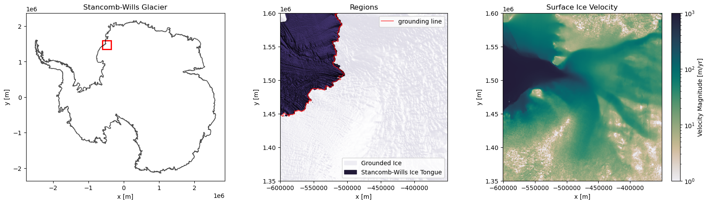

<p align="center">
  
</p>

# TopographyMCMC

Repository containing code for subglacial bed interpolation of the Stancomb-Wills Glacier in Eastern Anartica, utilizing Sequential Gaussian Simulation in combination with Markov-Chain Monte Carlo to produce physically constrained topographies with realistic roughness. The code within this repository is derived from Niya Shao's, linked below:

- https://github.com/NiyaShao/geostatisticalMCMC

## Table of Contents
1. [Overview](#overview)
2. [Glacier Background](#glacier-background)
3. [Methodology](#methodology)
4. [Usage Guide](#usage-guide)
5. [Repository Structure](#repository-structure)
6. [Data](#data)
7. [Contributors](#contributors)
---

## Overview

Subglacial topography, or the elevation of the bed underneath glaciers, is one of the greatest sources of uncertainty in climate change modeling. However, traditional bed interpolation methods such as kriging and sequential gaussian simulation fail to account for mass conservation, producing ice thicknesses that are incompatible with ice velocity measurements. Additionally, traditional inverse methods based on the mass conservation law produce overly smooth, unrealistic topographies. As a result, we introduce a Markov-chain Monte Carlo that preserves both realistic topographical roughness and mass conservation.

## Glacier Background

Our study area is the Stancomb-Wills Glacier, which is located on the Caird Coast on the western shore of the Weddell Sea. The glacier’s surface area is around 124,000 kilometers The ice stream feeds into the glacier's ice tongue at a rate of around 750 meters per year.
<p align="center">
  
</p>

Though the code and data below is run with this study area, the notebooks will apply to any areas with high velocity zones in Antartica.

## Methodology

- Our Markov chain Monte Carlo approach first involves computing a variogram to use sequential gaussian simulation to produce an initial topography. We then compute the ice flux divergence of this simulation. We then run a large-scale chain followed by a small-scale chain.
- **Large-Scale Chain**: For each iteration, we randomly perturb parts of the topography then recompute the ice flux divergence. If the divergence is less than that of the previous iteration, we keep this new topography.
- **Small-Scale Chain**: For each iteration, we use to sequential gaussian simulation to re-simulate parts of the topography then recompute the ice flux divergence. If the divergence is less than that of the previous iteration, we keep this new topography.
- This method was developed by Niya Shao and described in her paper:

Shao, N., MacKie, E., Field, M., & McCormack, F. (2025). A Markov chain Monte Carlo approach for geostatistically simulating mass-conserving subglacial topography. https://doi.org/10.31223/x5sb2r
<p align="center">
  
</p>

## Usage Guide

This repository of four primary notebooks and one auxillary one within the 'notebooks' folder. These notebooks step through the process of loading data and preprocessing it before performing the Markov Chain Monte Carlo Simulation. All data that is neccessary is referenced below, and all data that is produced is located within the 'data' folder. the 'figures' folder consist of various visualizations and realizations produced by the code in this repository. All libraries needed to run the code are found within the 'environment.yml' file for conda and the 'requirements.txt' for pip.

1. **T1_LoadData**: This notebooks contains the code for loading and processing the data from the data sources referenced below. Due to the size of the data used, it is not provided within this repository. However, the output of running this code for my study area is saved as 'StancombWillsDataGridded.csv' within the 'data' folder. 
2. **T2_StatisticalAnalysis**: This notebook is responsible for performing the intial sequential gaussian simulation required to star the Markov Chain Monte Carlo process. An example simulation is stored within the 'data' folder under 'sgs_bed.txt'.
3. **T3_LargeScaleChain**: This notebook contains the code for the Large-Scale Chain, which involves randomly perturbing the topography at each step to minimize the mass flux residual. The topography after running the Large-Scale Chain for 5,000,000 iterations can be found within the 'data' folder labeled as 'lsc_bed.txt'. Note that the notebook only shows the results from the last 500,000 iterations due to frequent modifications. The following table shows the parameters used to create the example bed givin. 

| Number of Iterations | Minimum Perturbation (meters) | Maximum Perturbation (meters) |
|---|---|---|
| 1,000,000 | 50 | 150 |
| 1,000,000 | 50 | 250 |
| 1,000,000 | 1 | 400 |
| 1,000,000 | 10 | 1000 |
| 500,000 | 10 | 2000 |
| 500,000 | 1 | 1500 |

5. **T4_SmallScaleChain**: This notebook contains the code for the Small-Scale Chain, which involves reperforming sequential gaussian simulation on small sections of the topography. The 'small-scale chain data' folder within the 'data' folder contains 10 mass conserving topographies that were collected over the course of 50,000 iterations. Multiple topographies allows us the better quantify uncertainty within the subglacial bed. 
6. **Visualizations**: This notebook contains code for the visualizations found within the 'figures' folder and in this README. 

## Repository Structure
```
TopographyMCMC/
├── README.md
├── LICENSE
├── environment.yml
├── requirements.txt
├── notebooks/
│   ├── T1_LoadData.ipynb
│   ├── T2_StatisticalAnalysis.ipynb
│   ├── T3_LargeScaleChain.ipynb
│   ├── T4_SmallScaleChain.ipynb
│   └── Visualizations.ipynb
├── data/
│   ├── StancombWillsDataGridded.csv
│   ├── sgs_bed.txt
│   ├── lsc_bed.txt
│   └── small-scale chain data/
│       ├──Stancomb_sgs1_bed_0.txt
│       ├──Stancomb_sgs1_bed_10000.txt
│       └──Stancomb_sgs1_bed_...
└── figures/
```
## Data

- MEaSUREs InSAR-Based Antarctica Ice Velocity Map (Ver 2), https://nsidc.org/data/nsidc-0484/versions/2
- Surface Mass Balance provided by RACMO2.3p2, https://www.projects.science.uu.nl/iceclimate/publications/data/2018/vwessem2018_tc/RACMO_Yearly/
- MEaSUREs ITS_LIVE Antarctic Grounded Ice Sheet Elevation Change (Ver 1), https://nsidc.org/data/nsidc-0782/versions/1
- BedMachine Topography, https://nsidc.org/data/nsidc-0756/versions/3
- BedMap3 Radar Data and Topography, https://www.bas.ac.uk/project/bedmap/#data
- MEaSUREs MODIS Mosaic of Antarctica for grounding line data, https://nsidc.org/data/nsidc-0730/versions/1

## Contributors
- Bakari Kerr
- Niya Shao
- Michael Field
- Emma MacKie
- Sean Hamilton
- Tien (Tyler) Le
